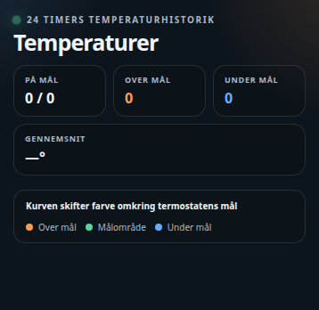

# HA Temperature Target Card



> HACS installs both JavaScript files automatically. For a manual installation,
> copy `ha-temperature-target-card.js` and `ha-card-list-editor.js` into the same folder.

A Home Assistant Lovelace card that shows each room's temperature history as
a graph whose line color shifts around the thermostat's current target —
orange above target, green on target, blue below — plus a live readout of
current temperature, setpoint and deviation.

The visual card editor provides entity pickers and add/remove controls for rooms.

Works with a plain temperature sensor alone (as a history-only graph), or
paired with a `climate` entity for a live target line, heating-status
detection, and a link to the thermostat's more-info dialog.

Plain JavaScript, no build step — copy the file in and register it as a
dashboard resource.

> **Note:** the card's on-screen labels are currently Danish only. There's
> no built-in translation layer yet — fork the file and edit the label
> strings directly if you need another language.

## Installation

### HACS (custom repository)

1. In HACS, go to **Frontend** → the three-dot menu → **Custom repositories**.
2. Add `https://github.com/MRDonnii/ha-temperature-target-card` as type
   **Dashboard**.
3. Install **HA Temperature Target Card** and add the resource if HACS
   doesn't do it automatically.

### Manual

1. Download `ha-temperature-target-card.js` from the latest release (or this
   repo).
2. Copy it to
   `config/www/community/ha-temperature-target-card/ha-temperature-target-card.js`.
3. Add it as a dashboard resource:
   ```yaml
   url: /local/community/ha-temperature-target-card/ha-temperature-target-card.js
   type: module
   ```

## Usage

Add the card via the dashboard editor (search for "Temperature Target") or
in YAML:

```yaml
type: custom:ha-temperature-target-card
title: Temperatures & setpoints
hours: 24
animation: true
rooms:
  - name: Living room
    temperature: sensor.living_room_temperature
    climate: climate.living_room
  - name: Garage
    temperature: sensor.garage_temperature
```

Only `name` is required per room. `temperature` drives the history graph;
`climate` (optional) adds the target line, heating status and the more-info
shortcut.

## Configuration reference

| Key | Description |
|---|---|
| `title` | Card header text |
| `hours` | Hours of history shown per graph (default `24`) |
| `animation` | Toggle CSS animations (default `true`) |
| `rooms` | List of room objects, see below |

### Room object

| Key | Description |
|---|---|
| `name` | Room label (required) |
| `temperature` | Temperature sensor — drives the current reading and the history graph |
| `climate` | `climate` entity — adds the target line, on/above/below-target status and heating detection |

Clicking a room card (or its **Åbn termostat** button) opens the room's
`climate` entity more-info dialog, falling back to the temperature sensor
if no `climate` entity is configured.

## License

MIT — see [LICENSE](LICENSE).
